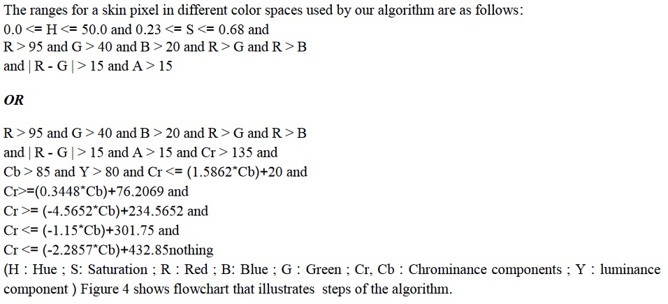

## Skin Detection
  
Detecting skin in images by using different color spaces.  
This is an implementation from the paper down below:  
https://www.atlantis-press.com/proceedings/iccasp-16/25871632  

here is the main part of the article in which the algorithm is explained.  

The algorithm described in the paper "Human Skin Detection Using RGB, HSV and YCbCr Color Models" involves a multi-step process for skin detection in images. The algorithm includes the following key steps:  
  
1. Conversion of ARGB values to HSV and YCbCr values using conversion factors and built-in functions.  
2. Comparison of the HSV, YCbCr, and ARGB values of each pixel with standard values of a skin pixel.  
3. Decision-making based on whether the values lie within predefined threshold ranges for each parameter in the different color spaces (HSV, YCbCr, and ARGB).  

